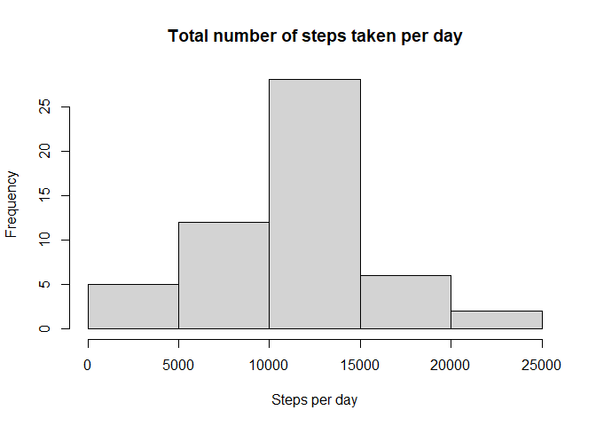
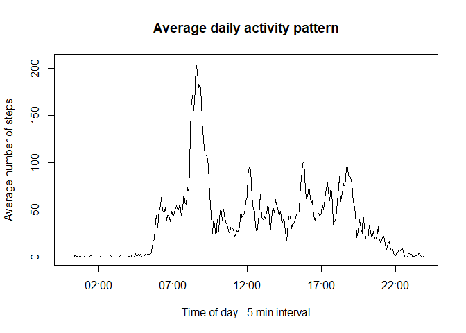
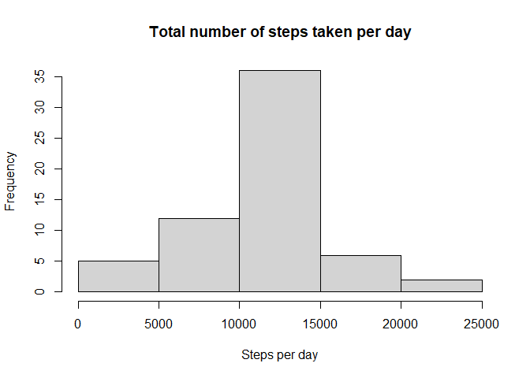
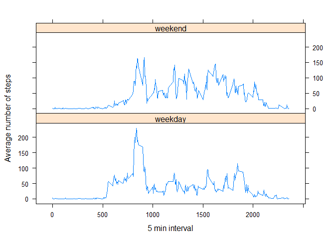

## Loading and preprocessing the data

```r
stepsdata<- read.csv("activity.csv")
stepsdata$time <-lapply(stepsdata$interval, sprintf, fmt="%00004.0f")
stepsdata$time <-sprintf("%s:%s",substr(stepsdata$time,1,2),substr(stepsdata$time,3,4))
stepsdata$date <- as.Date(stepsdata$date)
```

## What is mean total number of steps taken per day?


```r
stepsPerDay <- sapply(split(stepsdata$steps, stepsdata$date), sum)
hist(stepsPerDay, main="Total number of steps taken per day", xlab="Steps per day")
```

<!-- -->

```r
mean(stepsPerDay, na.rm=T)
```

```
## [1] 10766.19
```

```r
median(stepsPerDay, na.rm=T)
```

```
## [1] 10765
```

## What is the average daily activity pattern?

```r
averageSteps<-sapply(split(stepsdata$steps,stepsdata$time), mean, na.rm=TRUE)
activityPattern <- data.frame(times = unique(stepsdata$time), steps = averageSteps, row.names = NULL)
plot(strptime(activityPattern$times, format = "%H:%M"), activityPattern$steps, type="l", main="Average daily activity pattern", xlab = "Time of day - 5 min interval", ylab = "Average number of steps")
```

<!-- -->

```r
activityPattern$times[which.max(activityPattern$steps)]
```

```
## [1] "08:35"
```


## Imputing missing values

```r
navector<- is.na(stepsdata$steps)
sprintf("Number of missingvalues is %s.", sum(navector))
```

```
## [1] "Number of missingvalues is 2304."
```

```r
richstepsdata<-stepsdata
#missing values are being replaced by the 5 min average of that interval
richstepsdata$steps[is.na(richstepsdata$steps)] <- activityPattern$steps

richstepsPerDay <- sapply(split(richstepsdata$steps, richstepsdata$date), sum)
hist(richstepsPerDay, main="Total number of steps taken per day", xlab="Steps per day")
```

<!-- -->

```r
mean(richstepsPerDay, na.rm=T)
```

```
## [1] 10766.19
```

```r
median(richstepsPerDay, na.rm=T)
```

```
## [1] 10766.19
```
## Are there differences in activity patterns between weekdays and weekends?


```r
library(lattice)
# names of weekdays are unfortunately locale dependent. 
# If you borrow this code don't forget to update that
richstepsdata$dow <- as.factor(ifelse(weekdays(richstepsdata$date) %in% c("zaterdag", "zondag"), "weekend","weekday"))
averageWeekend <- aggregate(richstepsdata$steps, by = list(richstepsdata$interval, richstepsdata$dow), mean)
colnames(averageWeekend) <- c("interval", "dow", "average")

xyplot(averageWeekend$average ~ averageWeekend$interval | averageWeekend$dow, layout =c(1,2), type="l", xlab = "5 min interval", ylab = "Average number of steps")
```

<!-- -->
